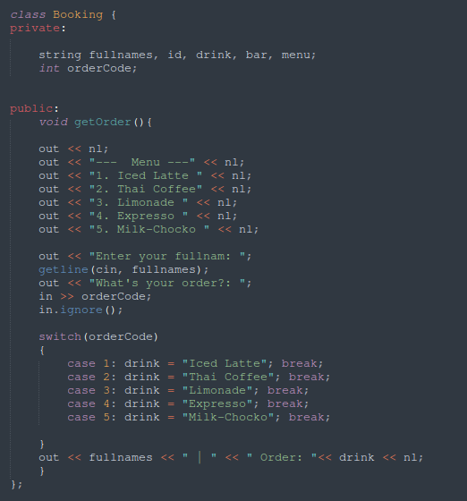
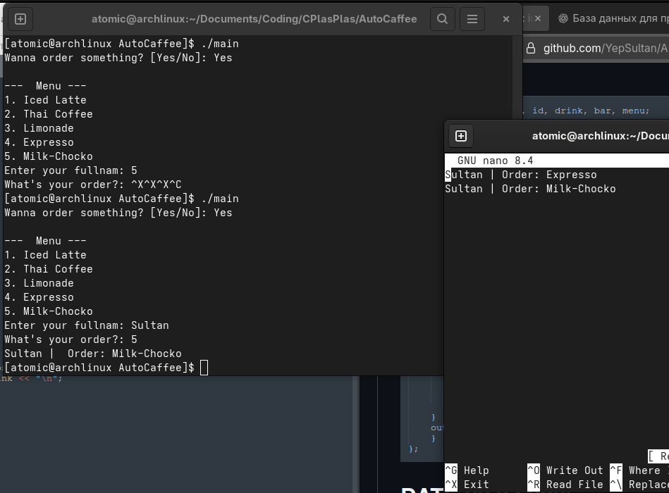
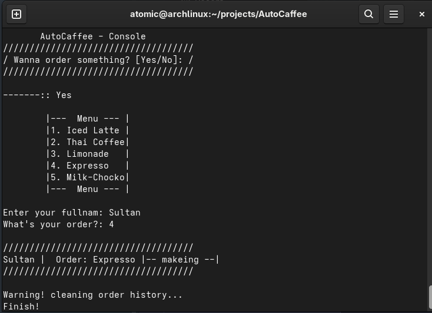

# 🚀 AutoCaffee — Console Order System


> Mini C++-based café order manager. No frills — just direct file handling and user input.  
> ✅ Goal: Train file I/O, control flow, and structure under real mini-project conditions.

---

## ✅ DONE

- [x] Registration system
- [x] Separated name vs full name logic
- [x] Created text-based order database (`orders.txt`)
- [x] Implemented `showMenu()` function
- [x] Switched from if/else to `switch-case` control flow
- [x] Cleaned up `getOrder()` function logic
- [x] Implement base viewer (show saved orders)

---

## 🛠️ TODO

- [ ] Add function to modify base (append/edit)
- [ ] Add menu editor (create/edit menu entries)
- [ ] Deletion by time (Cleaning the data)
---

## 🗓️ PROGRESS LOG

### 📅 21.07.2025

#### ⏱️ 11:35
- Replaced `if/else` with `switch-case` for input handling
- Refactored `getOrder()` → more readable & scalable
- Minor tests in `main()` passed

> "Not perfect, but I’m **building, learning, and improving daily**."

---

#### ⏱️ 18:30  
📸 Screenshot:



---

### 📅 22.07.2025

#### ⏱️ 23:30

### 💡 NEW FEATURE: File-Based Save System
- Added `#include <fstream>`
- Created method `Booking::saveToFile()`  
- Now saves:  
  `Fullname | Orders: <drink>` → to `orders.txt`

📂 Output: `orders.txt` (appending mode)

📸 Screenshot:



---

### 📅 28.07.2025

#### ⏱️ 17:00
📸 Screenshot:

- Redesing
- Created method `Booking::cleanTime()`
	- Used `thread` to clean the order history 

---

### 📅 30.07.2025

#### ⏱️ 17:00

!Succesfully completed `Implement base viewer`

- Used methods/libs `fstream`

| Read the file | Open / save to file |
|---------------|---------------------|
| ifstream      | ofstream            | 
| yourV.open    | std::ios::app       |
| getline()     |                     |

- ofstream:  `std::ios::app`
```cpp

private:
    void saveToFile(){
        ofstream file("orders.txt", std::ios::app);
	file << fullnames << " | Order: " << drink << "\n";
	file.close();
}

```

- ifstream: `readFile.open("names.txt");`

```cpp

public:
    void readTheFile(){
	ifstream readFile;
	readFile.open("orders.txt");

	string line;

	while (getline(readFile, line)){
		cout << line << nl;
	}

	readFile.close();
}

```

#### ⏱️ 17:35

- Created `Program` class 


---
## 🧠 TECH STACK

- C++ (Standard 17)
- Console-based UI
- File I/O via `<fstream>`

---

## 💬 NOTES
- Code is under iterative refactoring
- Focus on structure, not aesthetics
- Next goals: Add date/time logging, auto menu loader from file, CLI param control

---

## 📌 AUTHOR:  
Sultan - engineering student (self-dev)  
Project start: `21.07.2025`

---

